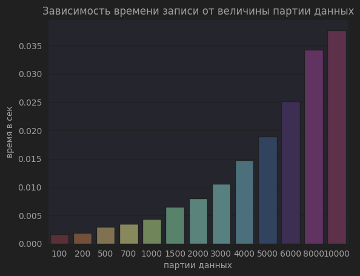
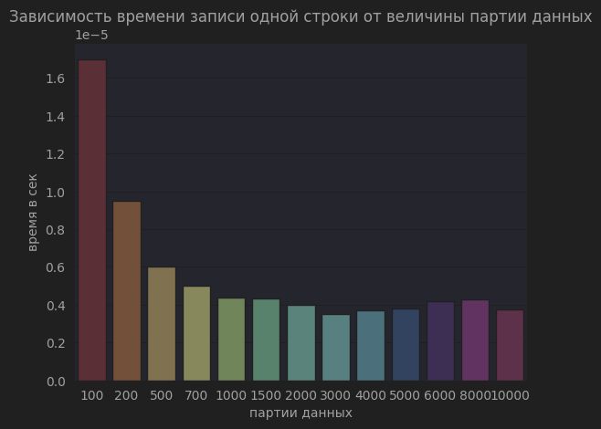
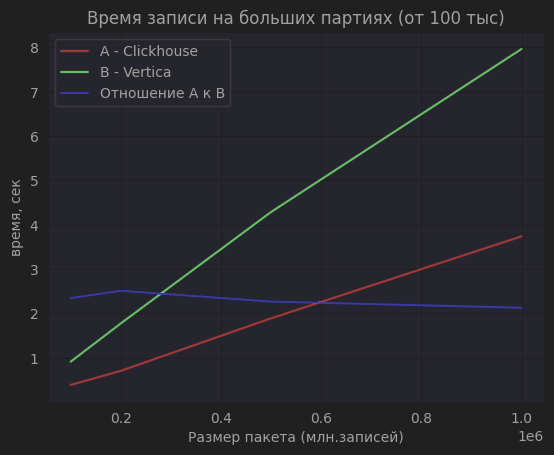

# Исследование: выбор хранилища
**Задача проекта** - сохранить метки данных о просмотрах фильмов из приложения в аналитическое хранилище.
  
**Цель исследования** - протестировать работоспособность схемы хранения и обработки данных, применительно на этой задаче

## 1. Подготовка кластера хранилища для работы  

- скачать папку storage_research и установить зависимости
- `docker-compose up -d` - поднять базы Clickhouse и Vertica
 
## 2. Загрузка или генерация первоначальных данных

- запустите по очереди скрипты clickhouse.py и vertica.py  

Вставка данных производится пачками по 10 тыс.записей.
В результате хранилища будут заполнены **10 млн.** сгенерированных данных. 
Предполагается (_в целях задачи)_, 1 млн. пользователей и 10000 фильмов.

## 3. Тестирование обработки данных, поступающих в реальном времени

Уже на предыдущей стадии было отмечено преимущество Clickhouse - загрузка 10 млн. записей прошла за 40 секунд.
Vertica справилась за 145 сек, т.е. в 3,5 раза медленней. 
Хотя оба результата могут считать превосходными.

Для запуска тестов вставки необходимо в папке test_results запустить скрипты (очередность неважна):
`insert_test_clickhouse.py` и `insert_test_vertica.py`  

Посмотрим на полученную сравнительную таблицу (файл `insert_test.csv`):  

| Chunk   | Clickhouse | Vertica |
|---------|------------|---------|
| 100     | 0.0018     | 0.0592  |
| 200     | 0.0020     | 0.0624  |
| 500     | 0.0029     | 0.0305  |
| 700     | 0.0039     | 0.0651  |
| 1000    | 0.0047     | 0.0710  |
| 1500    | 0.0067     | 0.0749  |
| 2000    | 0.0087     | 0.0760  |
| 3000    | 0.0114     | 0.0988  |
| 4000    | 0.0157     | 0.1080  |
| 5000    | 0.0206     | 0.1093  |
| 6000    | 0.0246     | 0.1212  |
| 8000    | 0.0334     | 0.1379  |
| 10000   | 0.0378     | 0.1507  |
| 100000  | 0.3895     | 0.9140  |
| 200000  | 0.7068     | 1.7759  |
| 500000  | 1.8914     | 4.2891  |
| 1000000 | 3.7396     | 7.9650  |

Мы видим, что при любой размерности пакета, Vertica загружается медленней. 
На небольших chunks разница достигает порой 10-кратного отставания. На крупных - примерно в два раза.
Следует отметить, что несмотря на то, что данные приводятся усредненные после выборки из 10 повторений по каждому типу пакета данных, 
при повторении теста разброс данных внутри каждого хранилища достигал порой 50%. 
Но только на размерах пакетов до 5 000 записей. На цифрах выше результаты гораздо стабильней - не больше 10%.

Ниже представлены данные победителя - хранилища Clickhouse с результатами от загрузки пакетов до 10 000 записей (включительно):

Зависимость времени загрузки пакета от его размерности прослеживается довольно четко.  
Но можно ли ответить на вопрос: "Какой пакет вставки данных будет наиболее эффективным?"  
Если взять за критерий эффективности теоретическую скорость вставки одной записи в пакете, 
то увидим следующий результат:

Удивительно, но, начиная с пакета данных в 1000 записей, 
колебания конечного результата можно считать не столь существенными. 
Лучший результат - у пакета на 300 записей. Однако, пакет в 10000 записей 
не ушел от него далеко в плане эффективности.  

Ниже представлен график записи крупными пакетами данных (до миллиона). 
Интересно, что cкорость записи Vertica как была в два с хвостиком раза меньше, чем у Clickhouse,
в начале графика (на 100тыс), так и осталась такой же на миллионе.

## 4. Тестирование обработки уже загруженных данных
Была протестирована обработка данных в хранилище. 
Для этого запустим скрипты (очередность важна): `select_test_clickhouse.py` и `select_test_vertica.py`
Запросы какого характера формировались можно посмотреть внутри скриптов.

| Clickhouse | Vertica | Описание запроса                          |
|------------|---------|-------------------------------------------|
| 0.0037     | 0.0105  | Список всех фильмов @юзера                |
| 0.0030     | 0.0109  | Все фильмы @юзера (+ лучший тайминг)      |
| 0.0029     | 0.0093  | Самый долгий просмотра @фильма @юзером    |
| 0.3660     | 0.3600  | Список юзеров смотревших @фильм           |
| 0.0012     | 0.0478  | Сколько всего записей                     |
| 0.5689     | 2.1874  | Средний тайминг просмотра каждого фильма  |
| 2.2394     | 3.3187  | Список всех юзеров                        |
| 3.0220     | 4.2815  | Сколько раз каждый юзер запускал просмотр |

Здесь также мы видим тотальное преимущество Clickhouse, хотя и не столь значительное - редко когда больше двукратного.

# Выводы
Понятно, что при оценке хранилища в критерии попадают самые разные параметры, это может быть особого рода функционал,
надежность, фидбек и прочее.  
Для проекта мы оперировали только вставкой и чтением записей и на основе этого исследования 
**Clickhouse показал себя более производительной СУБД, поэтому выбран нами в качестве OLAP-хранилища**